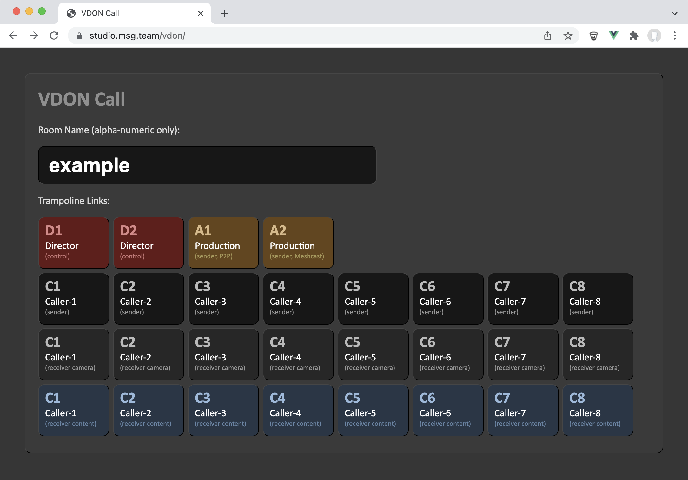
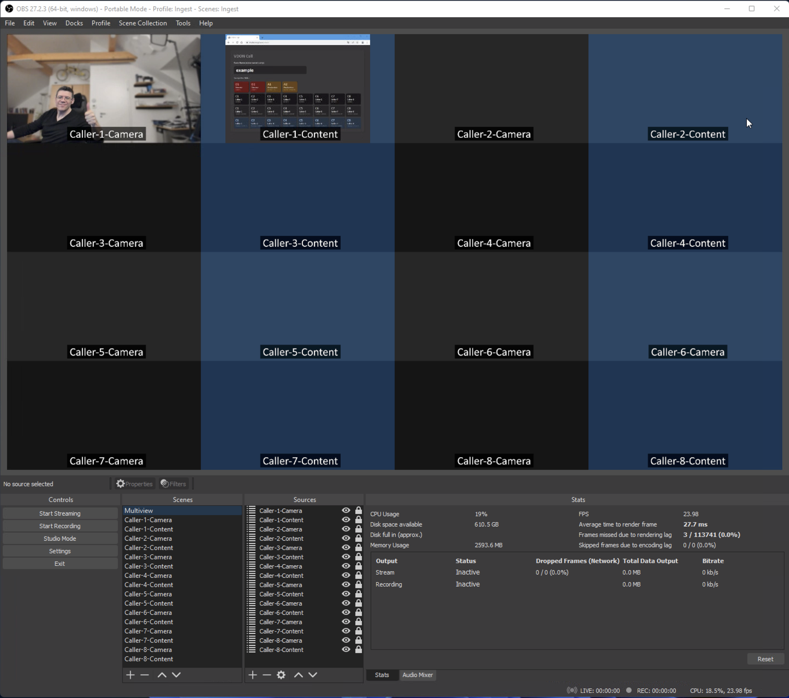
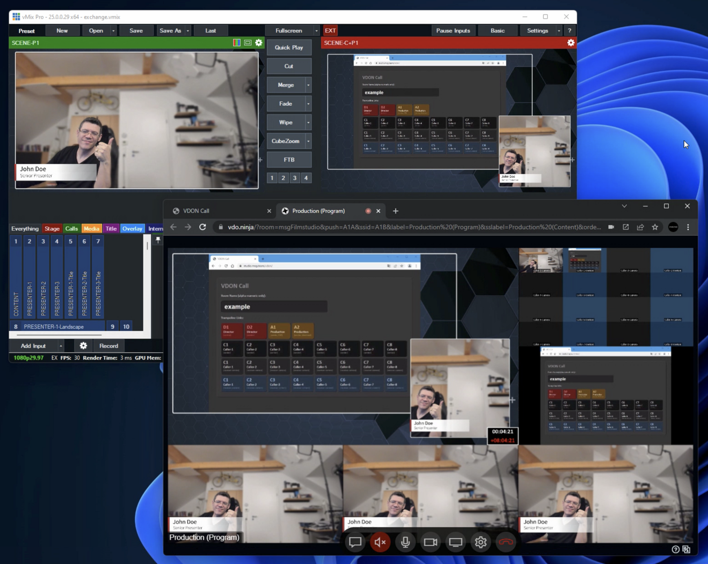

VDON Call
=========
  
This is a [WebRTC](https://en.wikipedia.org/wiki/WebRTC)/[NDI](https://ndi.tv)-based
remote caller ingest solution for video productions, based on
two swiss army knifes in their field: the awesome, low-latency,
P2P-based video streaming facility [VDO.Ninja](https://vdo.ninja),
and the awesome, ultra-flexible video mixer software
[OBS Studio](https://obsproject.com).

Motivation
----------

The name VDON Call of this solution is inspired by
[vMix Call](https://www.vmix.com/products/vmix-call.aspx), the great but
weaker facility it can substitute in practice. The motivation and
primary killer feature of VDON Call, in contrast to the otherwise also
awesome vMix Call, is that the callers can ingest their camera and
content in parallel without having to fiddle around with two independent
Browser tabs and that this dual-ingest approach is available for 8
callers in total instead of just 4 (notice that vMix Call supports a
maximum of 8 incoming video streams only). The resulting ingested video
streams are available as NDI streams on the local network and can be
easily consumed (usually on a separate computer) with a video mixing
software like vMix or OBS Studio.

Constraints
-----------

The underlying VDO.Ninja parameterization is very opinionated and
heavily optimized for a total of 16+1 video streams, to allow one to
ingest up to 8 callers with their camera and shared content (screen or
window) into the video production and to provide a return feed from the
video production back to the callers. The callers can hear but not see
each other, except the provided return feed is some sort of multiview
and shows the callers. This is intentional, as this is not a general
video conferencing solution, but just a way to ingest remote callers of a
video production. Please keep this in mind.

There are two particular bottlenecks in this approach, which are
addressed by the particular VDO.Ninja parameterization:

1. The caller receiver-side is an OBS Studio, acting as a WebRTC-to-NDI
   gateway and has to run on a medium gaming PC (Intel Core i7 11700KF,
   NVIDIA RTX 3070Ti, 32GB RAM) with just about a maximum of about 80%
   overall resource utilization. As a result, the callers camera use
   720p24 and a bitrate of 2000 kbps and the callers content use 1080p6
   and a bitrate of 3000 kbps.
    
2. The production sender-side, providing the return feed of the video 
   production back to the caller, should require no more than half of
   the uplink (50 mbps) and downlink (100 mbps) of the usual Internet
   connections available in Germany. As a result, the return feed uses
   1080p29.97 with a maximum bitrate of 3000 kbps.

Installation
------------

The solution consists of the following parts which have to be installed:

1. [vdon-call.html](vdon-call.html): the URL trampoline, a
   small webpage which generates the heavily parameterized VDO.Ninja
   URLs. Install it as `index.html` to an arbitrary Internet service.
   The page without any attached parameters is usually only used
   by the video production crew to generate URLs. The page
   with attached parameters is used by all VDON Call components
   to expand the short URLs to the underlying VDO.Ninja URLs.

2. [vdon-call/basic.ini](vdon-call/basic.ini) and
   [vdon-call.json](vdon-call.json): the OBS Studio profile and scene collection,
   which configures OBS Studio as a WebRTC-to-NDI gateway. For this to work,
   you have to install the following prerequisites:

   - [NDI Tools](https://www.ndi.tv/tools/)
   - [OBS Studio](https://obsproject.com/)
   - [OBS NDI](https://github.com/Palakis/obs-ndi/)

3. The solution optionally requires a video mixing software like vMix or
   OBS Studio to consume and mix the NDI streams of the callers and produce a
   program which can act as the return feed to the callers. This really
   has to run on a computer which is separate (but in the same LAN)
   to the WebRTC-to-NDI gateway.

Components
----------

The solution consists of the following logical parts:

- **URL Trampoline**

  This is the URL trampoline which is deployed to a publically reachable
  URL like `https://studio.msg.team/vdon/` and which can be used by the
  production crew to easily generate the required "short" URLs. Its
  trampoline functionality on access of these "short" URLs expand to the
  underlying, technical, heavily-parameterized VDO.Ninja URLs.

  

- **Caller (Sender)**

  This is the caller sender-side, i.e., Google Chrome opened a URL
  like `https://studio.msg.team/vdon/#/example/sender/C1/Caller-1`.
  The result the VDO.Ninja user interface, configured for a caller
  participating in a room where the user can only see its own camera and
  shared content preview and the return feed of the production (here
  a multiview from vMix).

  

- **Caller (Receiver)**

  This is the caller receiver-side, i.e., OBS Studio with the VDON
  Call profile and scene collection loaded which accesses URLs like
  `https://studio.msg.team/vdon/#/example/receiver/C1/camera` and
  `https://studio.msg.team/vdon/#/example/receiver/C1/content`. For an
  overview, a special multiview scene is in preview (and also exposed
  via NDI for inclusion into the multiview of the production -- see
  below).

  

- **Production (Sender)**

  This is the video production. It uses a video mixing software
  like vMix (shown here) or OBS Studio (an alternative). This
  production receives all callers (and the multiview) from OBS
  Studio via NDI and mixes them into a resulting program video
  stream. For convenience reasons, beside this program video
  stream, this vMix instance also exports a multiview video stream
  which shows the caller ingest multiview, selected callers, the
  program video stream and the clock. Either the program or (as
  shown shere) the multiview video stream is then send back to the
  callers via a companion Google Chrome instance accessing the URL
  `https://studio.msg.team/vdon/#/example/production/A1/p2p`.

  

- **Director (Control)**

  This is the optional VDO.Ninja director
  view, i.e., Google Chrome accessing the URL
  `https://studio.msg.team/vdon/#/example/director/D1/Director-1`
  where the production crew can send messages to the callers, adjust the
  parameters of the callers, etc.

  

Copyright & License
-------------------

Copyright &copy; 2022 [Dr. Ralf S. Engelschall](mailto:rse@engelschall.com) 
Licensed under [MIT](https://spdx.org/licenses/MIT)

